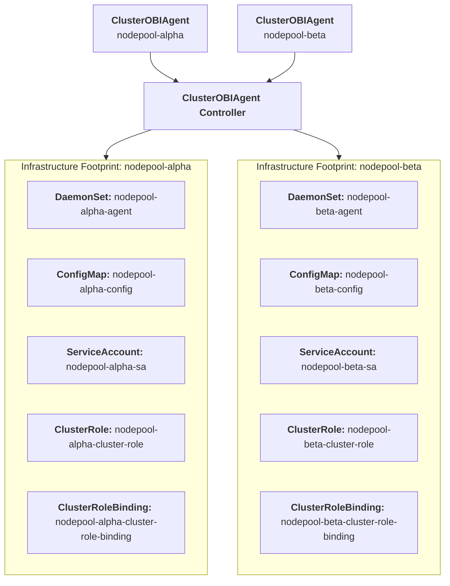
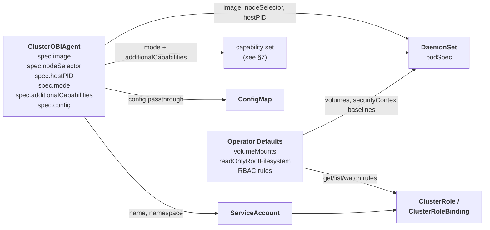

# Design Document: Introducing the ClusterOBIAgent Controller

## 1. Summary

This proposal introduces a new cluster-scoped Custom Resource Definition (CRD) named `ClusterOBIAgent` to the OpenTelemetry Operator. The goal is to automate the declarative provisioning and lifecycle management of OpenTelemetry’s eBPF out-of-process tracing engine (`otel/ebpf-instrumentation`). 

By standardizing this infrastructure layer into a dedicated controller, platform teams can unlock frictionless, language-agnostic HTTP/gRPC tracing and network topology tracking across application workloads without mutating tenant configurations, altering application binaries.

## 2. Motivation & Scope

The OpenTelemetry Operator currently handles application-level runtime SDK injections via the namespaced `Instrumentation` CRD and ingestion pipelines via `OpenTelemetryCollector`. However, it lacks a first-class, cluster-scoped automation pattern for host-level kernel telemetry generation.

Deploying and scaling eBPF daemons manually requires platform teams to handle complex Linux capability configurations, coordinate multi-tenant namespace filters, and manage specific vendor security permissions (such as Security Context Constraints on Red Hat OpenShift).

### Out of Scope / Boundaries of Responsibility
To ensure project scope safety and decouple maintenance loops, this architecture implements a **Shared Responsibility Model**:
* **Operator Domain:** The operator is exclusively responsible for the Kubernetes lifecycle automation (DaemonSet state, RBAC provisioning, platform-specific security matching).
* **eBPF SIG Domain:** The verification safety of the underlying BPF bytecode, user-space protocol translation efficiency, and Linux kernel version compatibility matrix remain strictly under the authority of the upstream eBPF Instrumentation SIG.

## 3. Walkthrough: Admin and Tenant Flow

This section walks through a single scenario end-to-end: a platform admin enables eBPF tracing, two tenant teams opt their workloads in, and the operator reconciles everything into concrete cluster resources.

### 3.1 Platform admin creates the ClusterOBIAgent

The admin wants application-mode tracing across all nodes, with delegation restricted to two tenant namespaces.

```yaml
apiVersion: opentelemetry.io/v1alpha1
kind: ClusterOBIAgent
metadata:
  name: production
spec:
  mode: application
  tenantDelegation:
    mode: AllowList
    namespacesAllowList:
      - tenant-alpha
      - tenant-beta
  config: |
    otel_traces_export:
      endpoint: http://otel-collector.observability:4318
```

### 3.2 Tenant teams create OBIInstrumentation resources

**tenant-alpha** — instrument all opted-in pods:

```yaml
apiVersion: opentelemetry.io/v1alpha1
kind: OBIInstrumentation
metadata:
  name: default
  namespace: tenant-alpha
spec:
  podAnnotations:
    instrument-with-obi: "true"
```

A deployment in `tenant-alpha` opting in:

```yaml
apiVersion: apps/v1
kind: Deployment
metadata:
  name: checkout-service
  namespace: tenant-alpha
spec:
  template:
    metadata:
      annotations:
        instrument-with-obi: "true"
    spec:
      containers:
        - name: checkout
          image: registry.example.com/checkout:v2.4.0
```

**tenant-beta** — instrument only critical-tier services:

```yaml
apiVersion: opentelemetry.io/v1alpha1
kind: OBIInstrumentation
metadata:
  name: critical-only
  namespace: tenant-beta
spec:
  podAnnotations:
    instrument-with-obi: "true"
    service-tier: critical
```

Pods in `tenant-beta` must carry **both** annotations to be instrumented.

### 3.3 What the operator creates

After reconciliation, the cluster contains the following operator-managed resources.

**DaemonSet** — one OBI pod per node, with the minimal capability set for `application` mode:

```yaml
apiVersion: apps/v1
kind: DaemonSet
metadata:
  name: production-agent
  namespace: opentelemetry-operator-system
spec:
  selector:
    matchLabels:
      app.kubernetes.io/instance: production
      app.kubernetes.io/managed-by: opentelemetry-operator
  template:
    spec:
      serviceAccountName: production-sa
      hostPID: true
      containers:
        - name: obi-agent
          image: otel/ebpf-instrument:v0.9.0
          securityContext:
            runAsUser: 0
            readOnlyRootFilesystem: true
            capabilities:
              add: [BPF, PERFMON, NET_RAW, SYS_PTRACE, DAC_READ_SEARCH, CHECKPOINT_RESTORE]
              drop: [ALL]
          volumeMounts:
            - name: obi-config
              mountPath: /config
              readOnly: true
            - name: var-run-obi
              mountPath: /var/run/obi
            - name: cgroup
              mountPath: /sys/fs/cgroup
            - name: kernel-security
              mountPath: /sys/kernel/security
              readOnly: true
      volumes:
        - name: obi-config
          configMap:
            name: production-config
        - name: var-run-obi
          emptyDir: {}
        - name: cgroup
          hostPath:
            path: /sys/fs/cgroup
        - name: kernel-security
          hostPath:
            path: /sys/kernel/security
```

**ConfigMap** — the admin's `spec.config` merged with discovery filters compiled from `OBIInstrumentation` resources. The `k8s_namespace` field is injected by the controller and cannot be overridden by tenants:

```yaml
apiVersion: v1
kind: ConfigMap
metadata:
  name: production-config
  namespace: opentelemetry-operator-system
data:
  obi-config.yml: |
    otel_traces_export:
      endpoint: http://otel-collector.observability:4318
    discovery:
      instrument:
        - k8s_namespace: tenant-alpha
          k8s_pod_annotations:
            instrument-with-obi: "true"
        - k8s_namespace: tenant-beta
          k8s_pod_annotations:
            instrument-with-obi: "true"
            service-tier: critical
```

**RBAC** — ServiceAccount, ClusterRole (read-only), and ClusterRoleBinding:

```yaml
apiVersion: v1
kind: ServiceAccount
metadata:
  name: production-sa
  namespace: opentelemetry-operator-system
---
apiVersion: rbac.authorization.k8s.io/v1
kind: ClusterRole
metadata:
  name: production-cluster-role
rules:
  - apiGroups: [""]
    resources: [pods, nodes, services]
    verbs: [get, list, watch]
  - apiGroups: [apps]
    resources: [deployments, replicasets, statefulsets, daemonsets]
    verbs: [get, list, watch]
---
apiVersion: rbac.authorization.k8s.io/v1
kind: ClusterRoleBinding
metadata:
  name: production-cluster-role-binding
roleRef:
  apiGroup: rbac.authorization.k8s.io
  kind: ClusterRole
  name: production-cluster-role
subjects:
  - kind: ServiceAccount
    name: production-sa
    namespace: opentelemetry-operator-system
```

### 3.4 What happens at runtime

| Pod | Namespace | Annotations | Instrumented? | Why |
|---|---|---|---|---|
| `checkout-service` | `tenant-alpha` | `instrument-with-obi: "true"` | Yes | Matches first filter item |
| `payment-api` | `tenant-beta` | `instrument-with-obi: "true"`, `service-tier: critical` | Yes | Matches both annotations in second filter item |
| `batch-worker` | `tenant-beta` | `instrument-with-obi: "true"` | No | Missing `service-tier: critical` — fields are AND'd |
| `anything` | `tenant-gamma` | `instrument-with-obi: "true"` | No | `tenant-gamma` not in allow-list — no filter item compiled |

Namespace isolation is structural: the controller injects `k8s_namespace` into every filter item, and OBI ANDs all fields within an item. A tenant's selectors can only ever match pods in their own namespace. Tenants have no write access to the ConfigMap.

## 4. Architecture & Topology

The controller supports two deployment models selected via `spec.deploymentModel`. Both models provision an identical privileged DaemonSet; they differ only in what runs inside it and how the configuration is managed.

### 4.1 Standalone (default)

The operator deploys the official `otel/ebpf-instrumentation` daemon. OBI hooks the host kernel and streams raw OTLP traces and metrics over the network to a separately managed `OpenTelemetryCollector` instance. This is the simpler path: lower resource overhead, single backend, no pipeline processing.

```
ClusterOBIAgent (standalone)   →  OTLP  →  OpenTelemetryCollector
otel/ebpf-instrumentation                    (user-managed, namespaced)
```

### 4.2 Collector (spec.deploymentModel: collector)

The operator deploys a user-provided collector image that embeds the OBI receiver component alongside standard OTel Collector processors and exporters. OBI runs inside the collector process, enabling tail-based sampling, PII redaction, and multi-backend export without a separate pipeline hop.

```
ClusterOBIAgent (collector)
└── otelcol-obi (user-built image)
    ├── OBI receiver  (eBPF instrumentation, generated by operator)
    ├── Processors    (tail sampling, attribute redaction — user config)
    └── Exporters     (OTLP to one or more backends — user config)
```

This model is appropriate when pipeline processing is required at the node level — particularly for compliance use cases where PII must be redacted before telemetry leaves the host.

#### Operator ownership in collector mode

The `receivers` section of the OTel Collector config is **reserved and managed exclusively by the operator**. It is generated from `OBIInstrumentation` resources at reconcile time and merged with the user-supplied config. If `spec.config` contains a `receivers` key, the CR is rejected at admission.

This constraint exists for two reasons:

1. **No inbound receivers.** A privileged DaemonSet must not accept incoming connections. User-supplied receivers (e.g. `otlp:`, `http:`) would open listening ports on every node inside a privileged container.
2. **No named OBI instances.** The OTel Collector supports multiple instances of the same receiver (`obi/foo`, `obi/bar`). Named instances would bypass the operator's tenant filter injection, breaking namespace isolation.

The config responsibility split in collector mode:

| Section | Owner | How |
|---|---|---|
| `receivers` | Operator | Generated from `OBIInstrumentation` resources |
| `processors` | User | `spec.config` passthrough |
| `exporters` | User | `spec.config` passthrough |
| `service.pipelines` | User | `spec.config` passthrough; must reference `obi` receiver |

Example `spec.config` for collector mode (receivers section omitted — operator generates it):

```yaml
processors:
  batch:
    timeout: 1s
  tail_sampling:
    policies:
      - name: errors
        type: status_code
        status_code: {status_codes: [ERROR]}
      - name: slow
        type: latency
        latency: {threshold_ms: 1000}
exporters:
  otlp:
    endpoint: https://backend:4317
service:
  pipelines:
    traces:
      receivers: [obi]
      processors: [tail_sampling, batch]
      exporters: [otlp]
    metrics:
      receivers: [obi]
      processors: [batch]
      exporters: [otlp]
```

The operator merges this with the generated receivers section at reconcile time before writing the ConfigMap.

#### Feature comparison

| | `standalone` | `collector` |
|---|---|---|
| Image | `otel/ebpf-instrumentation` (default) | User-provided |
| Config format | OBI daemon YAML | OTel Collector YAML (no `receivers` key) |
| Tenant filter injection path | `discovery.instrument` | `receivers.obi.discovery.instrument` |
| Tail-based sampling | No | Yes |
| PII redaction | No | Yes |
| Multi-backend export | Limited | Yes |
| Service auto-provisioned | No | No |
| Inbound receivers | Not applicable | Not supported |



## 5. Resource Configuration Model

Each `ClusterOBIAgent` CR instance is reconciled into a deterministic set of child resources. The controller derives the final resource manifests from three input streams: the CR spec, an environment probe (OpenShift vs. vanilla Kubernetes), and hardcoded operator defaults.



### Field Mapping

| Output resource | Field | Source | Notes |
|---|---|---|---|
| DaemonSet | `spec.template.spec.containers[0].image` | `CR .spec.image` | Defaults to `otel/ebpf-instrument:v0.9.0` |
| DaemonSet | `spec.template.spec.nodeSelector` | `CR .spec.nodeSelector` | Empty map if unset |
| DaemonSet | `spec.template.spec.hostPID` | `CR .spec.hostPID` | Defaults to `true` |
| DaemonSet | `spec.template.spec.containers[0].securityContext.capabilities` | `CR .spec.mode` + `CR .spec.additionalCapabilities` | Derived deterministically; see §7 |
| DaemonSet | `spec.template.spec.volumes` | Operator default | `emptyDir` (var-run-obi), `hostPath` (cgroup), `configMap` (config) |
| DaemonSet | `spec.template.spec.containers[0].securityContext.readOnlyRootFilesystem` | Operator default | Always `true` |
| DaemonSet | `spec.template.spec.containers[0].securityContext.runAsUser` | Operator default | Always `0` |
| ConfigMap | `data["obi-config.yml"]` | `CR .spec.config` | Untyped passthrough; operator does not interpret content |
| ServiceAccount | `metadata.name` | CR name (prefixed) | e.g. `<cr-name>-sa` |
| ClusterRole | `rules` | Operator default | `get/list/watch` on pods, nodes, services, workload resources |
| ClusterRoleBinding | `subjects[0]` | Derived from ServiceAccount | |

## 6. API Specification

The Go type definition below is the canonical API surface for `ClusterOBIAgent`, expressed using kubebuilder markers. The rendered CRD manifest generated from this file is available at [`clusterebpfagent-crd.yaml`](./clusterebpfagent-crd.yaml).

```go
// OBIAgentMode defines the set of OBI tracers to activate, which determines
// the Linux capabilities provisioned by the operator.
//
// application: HTTP/gRPC application observability via uprobes.
// network:     Network flow observability via TC programs.
// full:        Both application and network observability.
//
// +kubebuilder:validation:Enum=application;network;full
type OBIAgentMode string

const (
	OBIAgentModeApplication OBIAgentMode = "application"
	OBIAgentModeNetwork     OBIAgentMode = "network"
	OBIAgentModeFull        OBIAgentMode = "full"
)

// ClusterOBIAgentSpec defines the desired state of ClusterOBIAgent.
type ClusterOBIAgentSpec struct {
	// Image is the container image to use for the OBI DaemonSet.
	// Defaults to the operator's bundled OBI image version.
	// +optional
	Image string `json:"image,omitempty"`

	// ImagePullPolicy defines the pull policy for the OBI container image.
	// +optional
	ImagePullPolicy corev1.PullPolicy `json:"imagePullPolicy,omitempty"`

	// ImagePullSecrets is a list of references to secrets for pulling the OBI image.
	// +optional
	ImagePullSecrets []corev1.LocalObjectReference `json:"imagePullSecrets,omitempty"`

	// Mode selects the OBI operation mode and determines the base Linux capability
	// set provisioned by the operator. Defaults to application.
	//
	// application: provisions capabilities for HTTP/gRPC uprobe-based tracing.
	// network:     provisions capabilities for TC-based network flow observability.
	// full:        union of application and network capability sets.
	//
	// +optional
	// +kubebuilder:default=application
	Mode OBIAgentMode `json:"mode,omitempty"`

	// AdditionalCapabilities supplements the base capability set derived from Mode.
	// Use this for capabilities that are not required by the declared mode but are
	// needed for specific kernel configurations or optional OBI features, for example:
	//
	//   - SYS_ADMIN: required for Go library-level trace context propagation
	//                (bpf_probe_write_user). Also required on AKS and EKS where
	//                kernel.perf_event_paranoid > 1 by default.
	//
	// +optional
	AdditionalCapabilities []corev1.Capability `json:"additionalCapabilities,omitempty"`

	// HostPID controls whether the DaemonSet pods share the host PID namespace.
	// Required for OBI to resolve eBPF probe PIDs to container workloads.
	// Defaults to true.
	// +optional
	// +kubebuilder:default=true
	HostPID bool `json:"hostPID,omitempty"`

	// NodeSelector constrains which nodes the DaemonSet pods are scheduled to.
	// +optional
	NodeSelector map[string]string `json:"nodeSelector,omitempty"`

	// Tolerations allow the DaemonSet pods to be scheduled on nodes with matching taints.
	// +optional
	Tolerations []corev1.Toleration `json:"tolerations,omitempty"`

	// Resources defines compute resource requests and limits for the OBI container.
	// +optional
	Resources corev1.ResourceRequirements `json:"resources,omitempty"`

	// Config is the raw OBI configuration passed through verbatim to the agent ConfigMap.
	// The operator does not interpret or validate the content; it is mounted at
	// /config/obi-config.yml inside the DaemonSet pod.
	// The discovery.instrument section is reserved — it is generated by the controller
	// from OBIInstrumentation resources and must not be set here.
	// Refer to the OBI configuration documentation for available fields.
	// +optional
	Config string `json:"config,omitempty"`

	// TenantDelegation controls whether OBIInstrumentation resources in tenant
	// namespaces are honoured by the controller.
	// +optional
	TenantDelegation TenantDelegationSpec `json:"tenantDelegation,omitempty"`
}

// TenantDelegationMode defines how OBIInstrumentation resources are collected.
//
// AllowList: only namespaces in NamespacesAllowList may contribute instrumentation.
// AlwaysCollect: all namespaces may contribute instrumentation.
//
// +kubebuilder:validation:Enum=AllowList;AlwaysCollect
type TenantDelegationMode string

const (
	TenantDelegationModeAllowList     TenantDelegationMode = "AllowList"
	TenantDelegationModeAlwaysCollect TenantDelegationMode = "AlwaysCollect"
)

// TenantDelegationSpec defines the policy for OBIInstrumentation delegation.
type TenantDelegationSpec struct {
	// Mode controls which namespaces may contribute OBIInstrumentation resources.
	// Defaults to AllowList.
	// +optional
	// +kubebuilder:default=AllowList
	Mode TenantDelegationMode `json:"mode,omitempty"`

	// NamespacesAllowList is the explicit list of namespaces permitted to create
	// OBIInstrumentation resources. Only used when Mode is AllowList.
	// +optional
	NamespacesAllowList []string `json:"namespacesAllowList,omitempty"`
}

// ClusterOBIAgentStatus defines the observed state of ClusterOBIAgent.
type ClusterOBIAgentStatus struct {
	// Conditions represent the latest available observations of the ClusterOBIAgent state.
	// +optional
	// +listType=map
	// +listMapKey=type
	Conditions []metav1.Condition `json:"conditions,omitempty"`

	// ObservedGeneration is the most recent generation observed for this resource.
	// +optional
	ObservedGeneration int64 `json:"observedGeneration,omitempty"`

	// Image is the OBI container image resolved and applied to the DaemonSet.
	// +optional
	Image string `json:"image,omitempty"`
}

// +kubebuilder:object:root=true
// +kubebuilder:resource:scope=Cluster,shortName=cebpfa
// +kubebuilder:subresource:status
// +kubebuilder:printcolumn:name="Mode",type="string",JSONPath=".spec.mode",description="OBI operation mode"
// +kubebuilder:printcolumn:name="Image",type="string",JSONPath=".status.image",description="Applied OBI image"
// +kubebuilder:printcolumn:name="Age",type="date",JSONPath=".metadata.creationTimestamp"

// ClusterOBIAgent is the schema for the clusterebpfagents API.
// Each instance provisions an OBI DaemonSet and associated RBAC across the cluster.
type ClusterOBIAgent struct {
	metav1.TypeMeta   `json:",inline"`
	metav1.ObjectMeta `json:"metadata,omitempty"`

	Spec   ClusterOBIAgentSpec   `json:"spec,omitempty"`
	Status ClusterOBIAgentStatus `json:"status,omitempty"`
}
```

The rendered CRD for `OBIInstrumentation` is available at [`obiinstrumentation-crd.yaml`](./obiinstrumentation-crd.yaml).

```go
// OBIInstrumentationSpec defines the desired state of OBIInstrumentation.
type OBIInstrumentationSpec struct {
	// PodAnnotations defines the pod annotation selectors used to identify which
	// pods in this namespace should be instrumented by OBI.
	//
	// Each key-value pair must be present as an annotation on the pod for it to
	// be selected. Multiple entries are AND'd together.
	//
	// The controller compiles this into an OBI discovery filter scoped to the
	// namespace of this resource. Pods in other namespaces are never selected
	// regardless of their annotations.
	//
	// +optional
	PodAnnotations map[string]string `json:"podAnnotations,omitempty"`
}

// +kubebuilder:object:root=true
// +kubebuilder:resource:scope=Namespaced,shortName=obiinstr
// +kubebuilder:subresource:status

// OBIInstrumentation is the schema for the obiinstrumentations API.
// It allows namespace-scoped delegation of OBI instrumentation targeting to
// project administrators, without exposing host-level privileges or affecting
// workloads outside the resource's own namespace.
type OBIInstrumentation struct {
	metav1.TypeMeta   `json:",inline"`
	metav1.ObjectMeta `json:"metadata,omitempty"`

	Spec   OBIInstrumentationSpec   `json:"spec,omitempty"`
	Status OBIInstrumentationStatus `json:"status,omitempty"`
}
```

## 7. Security Posture

OBI instruments the host kernel via eBPF and requires elevated privileges by design. This section defines exactly which privileges are granted, how they are derived, and why.

> **Operator vs. helm chart default:** The upstream helm chart defaults to `privileged: true` — an acknowledged [developer experience shortcut](https://github.com/grafana/beyla/pull/528) for local environments such as Kind and Docker Desktop. The operator deliberately does not inherit this default. It provisions the minimal capability set required for the declared operation mode, which is the intended production posture.

### 7.1 Host Namespaces

| Field | Value | Source | Rationale |
|---|---|---|---|
| `hostPID` | `true` | `CR .spec.hostPID` (default: `true`) | Required for cross-container process visibility; eBPF probes cannot resolve PIDs to workloads without it |

### 7.2 Linux Capabilities

The operator looks up the base capability set for `spec.mode` from a fixed map, then appends `spec.additionalCapabilities`.

```go
var modeCaps = map[OBIAgentMode][]corev1.Capability{
    OBIAgentModeApplication: {BPF, PERFMON, NET_RAW, SYS_PTRACE, DAC_READ_SEARCH, CHECKPOINT_RESTORE},
    OBIAgentModeNetwork:     {BPF, PERFMON, NET_RAW, NET_ADMIN},
    OBIAgentModeFull:        {BPF, PERFMON, NET_RAW, SYS_PTRACE, DAC_READ_SEARCH, CHECKPOINT_RESTORE, NET_ADMIN},
}

caps := modeCaps[spec.Mode]
caps = append(caps, spec.AdditionalCapabilities...)
```

| Capability | application | network | full | Rationale |
|---|:---:|:---:|:---:|---|
| `BPF` | ✓ | ✓ | ✓ | Load and attach eBPF programs |
| `PERFMON` | ✓ | ✓ | ✓ | Access perf events; load BPF programs (kernel ≥ 5.8) |
| `NET_RAW` | ✓ | ✓ | ✓ | `AF_PACKET` raw sockets for socket filter programs |
| `SYS_PTRACE` | ✓ | — | ✓ | Access `/proc/pid/exe`; inspect ELF binaries across container namespaces |
| `DAC_READ_SEARCH` | ✓ | — | ✓ | Access `/proc/self/mem` and ELF files across UID boundaries |
| `CHECKPOINT_RESTORE` | ✓ | — | ✓ | Access `/proc` symlinks for process and system info |
| `NET_ADMIN` | — | ✓ | ✓ | TC (`BPF_PROG_TYPE_SCHED_CLS`) programs for network monitoring and context propagation |
| `SYS_ADMIN` | — | — | — | Via `spec.additionalCapabilities` only; see note below |

> **`SYS_ADMIN`:** Required for Go library-level trace context propagation via `bpf_probe_write_user`. Also required on AKS and EKS, where `kernel.perf_event_paranoid > 1` by default, making `PERFMON` alone insufficient. Users on self-managed clusters who do not need Go distributed tracing can omit it. The operator sets `OTEL_EBPF_ENFORCE_SYS_CAPS=1` unconditionally so that any capability mismatch surfaces immediately as a pod failure rather than silently degraded telemetry.

### 7.3 Volume Mounts

| Volume | Type | Mount path | Rationale |
|---|---|---|---|
| `obi-config` | `ConfigMap` | `/config` (read-only) | Agent configuration passthrough |
| `var-run-obi` | `emptyDir` | `/var/run/obi` | Ephemeral socket between eBPF probe and user-space agent |
| `cgroup` | `hostPath: /sys/fs/cgroup` | `/sys/fs/cgroup` | cgroup membership resolution; maps sockets to container workloads |
| `kernel-security` | `hostPath: /sys/kernel/security` | `/sys/kernel/security` (read-only) | Kernel lockdown mode detection; determines whether `bpf_probe_write_user` is available under Secure Boot |

### 7.4 OpenShift: SecurityContextConstraints

On OpenShift, pod security is governed by SCCs rather than raw Linux capabilities. The operator detects OpenShift at reconcile time and takes a different path: instead of setting `capabilities.add` on the container, it creates and manages a purpose-built `SecurityContextConstraint` and binds it directly to the agent `ServiceAccount`.

This is the established pattern for OpenShift operators that deploy privileged workloads — see the [NetObserv operator](https://github.com/netobserv/netobserv-operator/blob/main/internal/controller/ebpf/internal/permissions/permissions.go) as a reference implementation.

The operator does **not** assign the built-in `privileged` SCC. That SCC permits far more than OBI requires (unrestricted hostNetwork, any user, any volume type). A purpose-built SCC with only the required capabilities is the correct least-privilege approach.

The generated SCC reflects the declared `spec.mode`:

```go
scc := &osv1.SecurityContextConstraints{
    ObjectMeta: metav1.ObjectMeta{Name: cr.Name + "-scc"},
    AllowHostPID: true,
    AllowHostDirVolumePlugin: true,   // required for cgroup and kernel-security hostPath mounts
    AllowedCapabilities: modeCaps[spec.Mode],
    RunAsUser:   osv1.RunAsUserStrategyOptions{Type: osv1.RunAsUserStrategyRunAsAny},
    SELinuxContext: osv1.SELinuxContextStrategyOptions{Type: osv1.SELinuxStrategyRunAsAny},
    Users: []string{
        "system:serviceaccount:" + cr.Namespace + ":" + cr.Name + "-sa",
    },
}
```

The SCC binds to the agent `ServiceAccount` via the `Users` field — the OpenShift-native binding mechanism, distinct from Kubernetes RBAC. `spec.additionalCapabilities` are appended to `AllowedCapabilities` using the same logic as the vanilla Kubernetes path.

## 8. Multi-Tenant Governance Model

### 8.1 Overview

The operator implements a two-CRD hierarchical governance model that separates infrastructure ownership from application targeting:

| CRD | Scope | Owner | Responsibility |
|---|---|---|---|
| `ClusterOBIAgent` | Cluster | Admin | DaemonSet lifecycle, Linux capabilities, node targeting, delegation policy |
| `OBIInstrumentation` | Namespace | Tenant | Pod annotation selectors for workloads in their own namespace |

Cluster administrators retain exclusive control over host-level privileges. Tenant project administrators get self-service instrumentation opt-in without any path to host access or cross-namespace targeting.

This follows the same hierarchical pattern established by the [NetObserv operator's `FlowCollector` / `FlowCollectorSlice`](https://docs.openshift.com/container-platform/latest/observability/network_observability/flowcollector-api.html) model.

### 8.2 Delegation Modes

The `ClusterOBIAgent` controls whether `OBIInstrumentation` resources are honoured via `spec.tenantDelegation.mode`:

**`AllowList` (default):** Only namespaces explicitly listed in `spec.tenantDelegation.namespacesAllowList` may create `OBIInstrumentation` resources. Resources in unlisted namespaces are ignored by the controller. This is the recommended default — administrators explicitly onboard tenants.

**`AlwaysCollect`:** Any namespace may create an `OBIInstrumentation` resource and the controller will honour it. Suitable for clusters where all tenants are trusted or where broad observability coverage is desired.

```yaml
spec:
  tenantDelegation:
    mode: AllowList             # AllowList | AlwaysCollect
    namespacesAllowList:
      - tenant-alpha
      - tenant-beta
```

### 8.3 Compilation Loop

During each reconciliation pass the controller:

1. Reads `ClusterOBIAgent.spec.config` — the global OBI configuration (export endpoints, log levels, network settings).
2. Lists all `OBIInstrumentation` resources across the cluster (or within allowed namespaces, depending on mode).
3. For each `OBIInstrumentation`, generates an instrument item and **injects `k8s_namespace`** set to the resource's own namespace:

```go
for _, instr := range obiInstrumentations {
    item := map[string]any{
        "k8s_namespace":      instr.Namespace,   // always injected by controller
        "k8s_pod_annotations": instr.Spec.PodAnnotations,
    }
    discoveryFilters = append(discoveryFilters, item)
}
```

4. Merges the global config with the compiled discovery filters into a single ConfigMap.
5. The ConfigMap is owned exclusively by the operator ServiceAccount. Tenants have no write path to it.

The result for a two-tenant cluster:

```yaml
discovery:
  instrument:
    - k8s_namespace: tenant-alpha       # injected; from OBIInstrumentation in tenant-alpha
      k8s_pod_annotations:
        obi.instrument: "true"
    - k8s_namespace: tenant-beta        # injected; from OBIInstrumentation in tenant-beta
      k8s_pod_annotations:
        obi.instrument: "true"
```

### 8.4 Namespace Isolation Guarantee

The namespace isolation guarantee is structural rather than policy-based. OBI's discovery filter engine ANDs all fields within a single instrument item — a process must match every field to be instrumented. Because the controller injects `k8s_namespace` into every item, a tenant's pod annotation selector can only ever match pods in their own namespace, regardless of how broad the selector is.

This was verified against the OBI source: `Matcher.matchByAttributes()` (`pkg/appolly/discover/matcher.go:301-333`) returns `false` on the first non-matching field before any eBPF attachment occurs. The namespace value is populated from `pod.Namespace` in the Kubernetes API — it is not user-controllable from within a pod.

> **Dependency:** The isolation guarantee relies on OBI correctly enforcing `k8s_namespace` filter semantics. Correctness of the underlying BPF filter logic remains the responsibility of the eBPF Instrumentation SIG, as defined in the shared responsibility model in §2.
